RiskSphere - Enterprise Risk & Compliance Management Platform

RiskSphere is a production-grade GRC (Governance, Risk, and Compliance) platform designed for large-scale organizations, financial institutions, and consulting firms. It provides a centralized hub for managing organizational risks, tracking compliance across multiple frameworks, and monitoring incidents in real-time.



Key Features

1. Multi-Tenant Architecture
Data Isolation: Secure data separation between different organizations.
Organization Management: Onboard and manage multiple companies within a single instance.
Role-Based Access Control (RBAC): Granular permissions for Super Admins, Risk Managers, Compliance Officers, and Auditors.

2. Risk Management
Risk Register: Comprehensive tracking of operational, financial, cybersecurity, and legal risks.
Automated Scoring: Dynamic risk score calculation based on Likelihood and Impact (Score = L × I).
Heatmap Visualization: Visual representation of risk exposure.
Mitigation Tracking: Link risks to specific mitigation plans and tasks.

3. Compliance Tracking
Framework Support: Manage compliance for ISO 27001, SOC 2, GDPR, and more.
Requirement Mapping: Track progress against specific regulatory requirements.
Evidence Management: Centralized repository for compliance evidence.

4. Incident Management
Real-time Reporting: Quick reporting of security breaches, system outages, and operational failures.
Investigation Workflow: Track incidents from reporting to resolution and closure.
Root Cause Analysis: Document findings and corrective actions.

5. AI Risk Assistant
Intelligent Analysis: Powered by Gemini 3 Flash for real-time risk assessment.
Mitigation Recommendations: AI-driven suggestions for risk reduction strategies.
Natural Language Interface: Interact with your risk data using conversational AI.

6. Advanced Analytics & Reporting
Executive Dashboard: High-level metrics for board-level decision making.
Data Export: Export risk registers and reports in CSV and PDF formats.
Trend Analysis: Monitor risk and compliance trends over time.

Tech Stack

Frontend: React, Tailwind CSS, TypeScript, Framer Motion, Lucide React.
Backend: Node.js, Express, SQLite (Better-SQLite3).
Authentication: JWT (JSON Web Tokens) with secure password hashing (Bcrypt).
AI: Google Gemini API (@google/genai).
Visualization: Recharts, D3.js.
Real-Time: Socket.io (Infrastructure ready).

Security

JWT Authentication: Secure session management.
RBAC: Strict access control based on user roles.
Input Validation: Protection against common web vulnerabilities.
Audit Logging: Comprehensive logs of all critical system actions.

Project Structure

```
/src
  /components     # Reusable UI components
  /pages          # Main application pages
  /services       # API and AI service layers
  /types.ts       # Global TypeScript definitions
/server.ts        # Express server with API routes
/db.ts            # Database schema and seeding logic
```

Getting Started

1.  Login: Use the default admin credentials:
    Email: `admin**********.com`
    Password: `******`
2.  Explore: Navigate through the Dashboard, Risk Register, and Compliance modules.
3.  AI Assistant: Click the floating AI icon to get expert risk management advice.


Developed as a showcase for enterprise-grade SaaS architecture.
